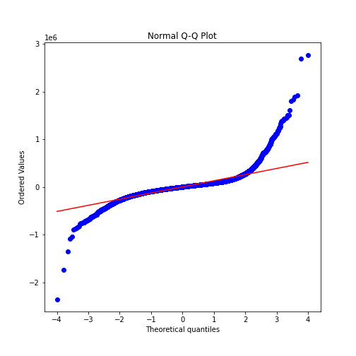
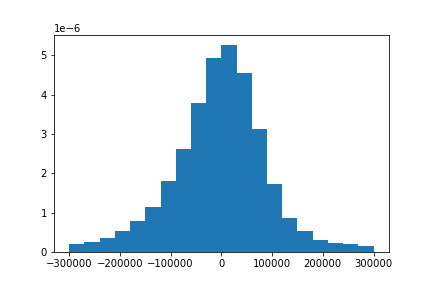

# King County Housing Analysis

**Authors** Kevin McDonough & Kyle Dufrane


## Business Understanding

Our stakeholder is a family that is moving to the Seattle area. They're looking for a solution that will enable them to search for properties based on their needs.  


### Data Understanding

This project uses the King County House Sales dataset, which can be found in  `KC_with_hoods.csv` in the data folder in this repo. The description of the column names can be found in `column_names.md` in the same folder. Through our Linear Regression model we can show what elements have an effect on the sale price of a house and accurately predict what the price will be. We found that the top three main factors on sale price are:

* Zip_city
* yr_renovated

This dataset contains house sale prices for King County, which includes Seattle. It includes homes sold between May 2014 and May 2015. In the datframe above, we used an API that allowed us to reverse geocode the latitude and longitude into neighborhoods. The code for this can be found in our individual technical notebooks. The process of reverse geocoding all 21,597 entries in our DataFrame took ~5 hours.
 

### Data Preparation

Our exploratory data analysis began with identifying feature types and null values. We elminated all null values and replaced them with the median value of their respective columns due to the columns having a binary value. I.E. 1 in waterfront shows the house is waterfront while 0 shows the  house is not waterfront property. 

Next, we stripped the data column and created two separate columns (year and month). Once the columns were created we used the OrdinalEncoder to created new columns for each value within the column.

Once our data was cleaned, we identified our highest correlated columns to use in the model and dropped any that may negatively effect out model. When multicollinearity was identified, we removed one of the values from the pair which had the least effect on the model. In total, we found two instances of two values having a high collinearity with each other. We chose to drop sqft_lot and sqft_above. See below results.

Lastly, we chose our relevant columns that would have a positive effect on the model. Refer to techincal notebook for said columns. 


Collinearity:

|  Column        |Collinearity|
|----------------|:----------:|
| price          |   1.000000 |
| prediction     |   0.926310 |
| sqft_grade     |   0.756248 |
| sqft_living    |   0.701917 |
| grade          |   0.667951 |
| sqft_living15  |   0.585241 |
| bathrooms      |   0.525906 | 
| view           |   0.393497 |
| residual       |   0.376762 | 
| sqft_basement  |   0.321108 | 
| bedrooms       |   0.308787 | 
| waterfront     |   0.264306 |
| floors         |   0.256804 |
| sqft_lot15     |   0.082845 |
| yr_built       |   0.053953 |
| condition      |   0.036056 |
| Yr_sold        |   0.003727 | 
| zipcode        |  -0.053402 |


Multicollinearity:

| pairs                      | cc            |
| ---------------------------|:-------------:| 
| sqft_above, sqft_living    |   0.876448    |
| sqft_living, grade         |   0.762779    |
| sqft_living15, sqft_living |   0.756402    |
| grade, sqft_above          |   0.756073    |
| bathrooms, sqft_living     |   0.755758    |
| sqft_living15, sqft_above  |   0.731767    |
| sqft_lot15, sqft_lot       |   0.718204    |
| grade, sqft_living15       |   0.713867    |
| price, sqft_living         |   0.701917    |
| sqft_above, bathrooms      |   0.686668    |


## Modeling

This project utilized Linear Regression and follows the assumptions of Linear Regression. Below you will see our assumption checks based on our final model:

**Q-Q Plot**


**Heteroscedasticity**



**Normalization**




To take advantage of other correlations we used PolynomialFeatures from the sklearn.preprossing library. Our findings showed a strong correlation between square footage(x3) and grade(x9). Seeing this correlation we multiplied the columns by eachother and saw an increase in the R-squared value of 0.04.

PolynomnialFeatures(degree=2) results:


|col - val| Collinearity |
|---------|--------------|
| x0      |  1.000000    |
| x0^2    |  0.839331    |
| x0 x1   |  0.937872    |
| x0 x2   |  0.917409    |
| x0 x3   |  0.900728    |
| x0 x5   |  0.908166    |
| x0 x8   |  0.945235    |
| x0 x9   |  0.982774    |
| x0 x10  |  0.890669    | 
| x0 x12  |  0.999584    |
| x0 x13  |  0.938750    |
| x3 x9   |  0.756248    |

Lastly, for our final model, we used the OneHotEncoder through the sklearn.preprocessing library. We encoded three categorical values being the mo_sold (month sold), Zip_city (city & zip code), yr_renovated (year renovated). 

Once these items were encoded our R-squared increased 0.84.


### Evaluating


### Deployment


### Next Steps


## For More Information


## Repository Structure

```
├── README.md                          
├── Technical_Notebook.ipynb   
├── King_County_Presentation.pdf         
├── data                            
└── Visualizations
```